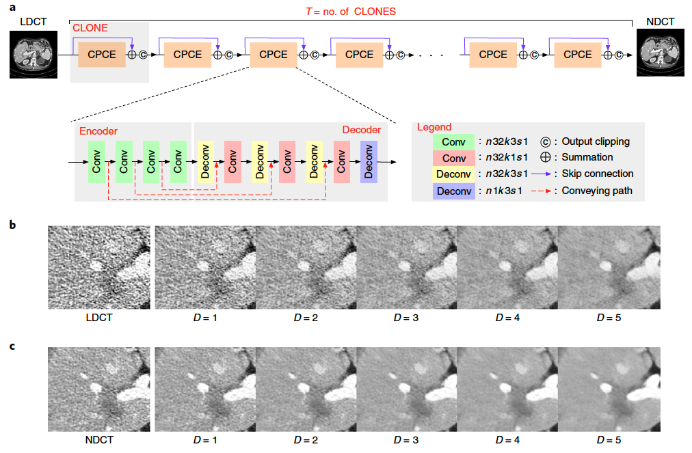
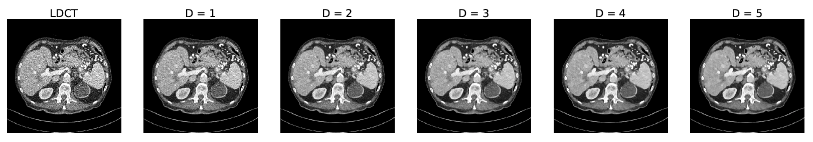

# Modularized Adaptive Processing Neural Network (MAP-NN)

This repository contains the code for our neural network “MAP-NN” described in the following paper:

### [Competitive performance of a modularized deep neural network compared to commercial algorithms for low-dose CT image reconstruction](https://doi.org/xxxx) (Nature Machine Intelligence, June 10, 2019)

## Prerequisites
The dependent packages for MAP-NN are as follows:

* Python v2.7
* TensorFlow v1.8.0
* Numpy v.1.2.2
* Scikit-learn v0.19.1
* Matplotlib v2.1.2
* CUDA v9.2

## Usage

### Prepare the training data

In order to start the training process, please prepare your ``training data`` in the following form:

*  ``data``: N x 1 x W x H  
* ``label``: N x 1 x W x H 

where ``data`` and ``label`` represent the low-dose and normal-dose CT patches respectively, N, W, and H are the number, width, and height of the training data respectively. In this study, ``N=128,000``, ``W=H=64``, and ``data`` and ``label`` are stored in your ``hdh5`` file. 

Note that the real training and validation sets are around ``2GB`` and ``1GB`` respectively. Here we only randomly sampled our original data into reduced training and validation sets of ``1,280`` and ``1,280`` patches of size ``64x64`` respectively to run the training script. However, here we have provided the fully trained model for you to reproduce the denoising results reported in our paper.

### Training network

Once the training data are ready, you can directly change the filename in the training script ``MAP_NN_training.py``.

```
python MAP_NN_Training.py
``` 
### Testing network

After specifying the testing file name in the testing script ``MAP_NN_Demo.py``, please run the following command to obtain the denoised images.

```
python MAP_NN_Demo.py
``` 
will give you the denoised images. 

For example, we take a LDCT image ('L506_FD_1_1.CT.0002.0087.2015.12.22.20.19.52.894480.358591878.IMA').  The model will load this LDCT image and produce the denoised images at different denoising depths, which are then saved into the file ``test_results.pdf``.



## Citation

If you find this code or our work useful, please cite the following paper:

```
@article{shan2019competitive,
  title={Competitive performance of a modularized deep neural network compared to commercial algorithms for low-dose CT image reconstruction},
  author={Shan, Hongming and Padole, Atul and Homayounieh, Fatemeh and Kruger, Uwe and Khera, Ruhani Doda and Nitiwarangkul, Chayanin and Kalra, Mannudeep K and Wang, Ge},
  journal={Nature Machine Intelligence},
  year={2019}
}
```
## Acknowledgement

The code was modified from [https://github.com/igul222/improved\_wgan\_training](https://github.com/igul222/improved_wgan_training).


## Contact

shanh at rpi dot edu

Any discussions, suggestions and questions are welcome!


